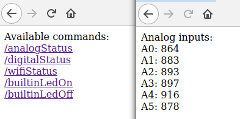

# **ArduinoWifiWebserver**  
A very simple WebServer hosted on Arduino accessible through home WiFi network.  
Supposed to be used as a POC for projects with controlling the board over network (using webbrowser or `curl`).  
Currently through the browser one can monitor analog/digital channels, WiFi status and turn on/off builtin LED.  

## Getting started

### Prerequisites  
+ Arduino board with WiFi module (tested with [Arduino UNO WiFi Rev.2](https://store.arduino.cc/arduino-uno-wifi-rev2))
+ Arduino IDE (tested with 1.8.14 hourly build)
+ [WiFiNINA](https://www.arduino.cc/en/Reference/WiFiNINA) library installed

### Installing and running  
Clone (or fork) this repo, `cd` to its folder, plug-in your board, put your home WiFi network settings to `arduino_secrets.h` (use [this file](arduino_secrets_template.h) as a template) and upload the sketch  
from the console (device port maybe different on your machine)  
```
arduino --upload ArduinoWifiWebserver.ino --port /dev/ttyACM0
```
or using "Upload" button in Arduino IDE.  
Run serial monitor after a while and check if board is connected to WiFi.  
After connection to WiFi network is established try to access webserver with a browser or `curl`.

### Wifi notes  
Default IP address for webserver is `192.168.4.1` (unless it's overridden by your WiFi network).  
If you want to change it place something like
```
WiFi.config(IPAddress(192, 168, 0, 77));
```
in the sketch.  
Tested with WPA2 networks only, but should work with WEP as well.  
**Does not work in 5Ghz networks (at least Arduino UNO WiFi Rev.2).**  
